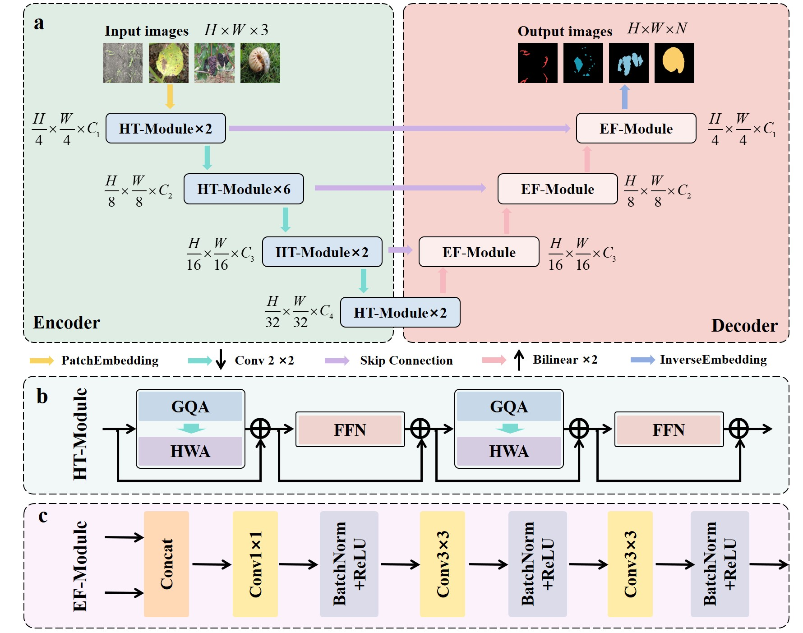
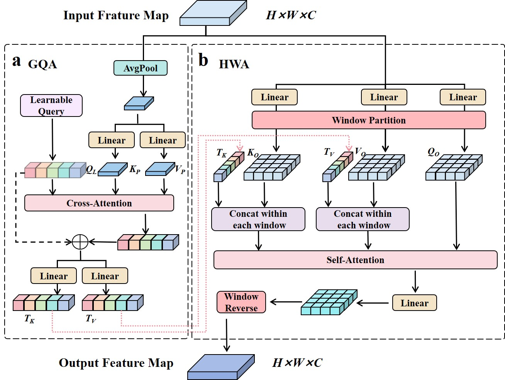
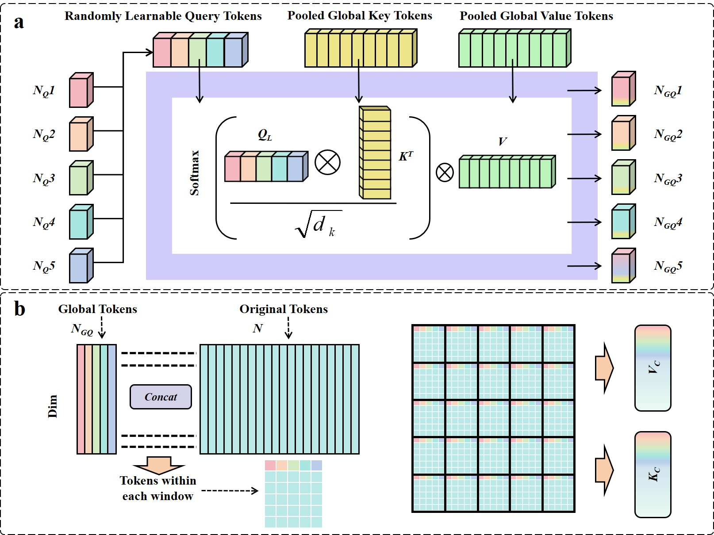

<h1>DyGLW-Net: Dynamic Global-guided Local Window Network for Agricultural Image Segmentation</h1> 

    <a>Yucong Wang</a>;
    <a>Guorun Li</a>;
    <a>Wang Liu</a>;
    <a>Liu Lei</a>;
    <a>Xiaoyu Li</a>;
    <a>Yuefeng Du*</a>;

<h3><strong>submitted to ESWA in 2026

## 🏠 TODOs
* [x] DyGLW-Net model.

## 🏠 Overview

## Important Note (Training)

This repository mainly provides the model architecture code. **For training, please follow the training pipeline from another repository under my GitHub account** and reuse its data organization, configs/hyperparameters, training scripts, and logging setup.

- Training repository: Simple-Attention
- Recommended workflow: reuse the training pipeline from the repo above and plug this model module into its training entry.

If you encounter any integration issues (e.g., mismatched interfaces or configs), please open an issue with your environment details and error logs.
